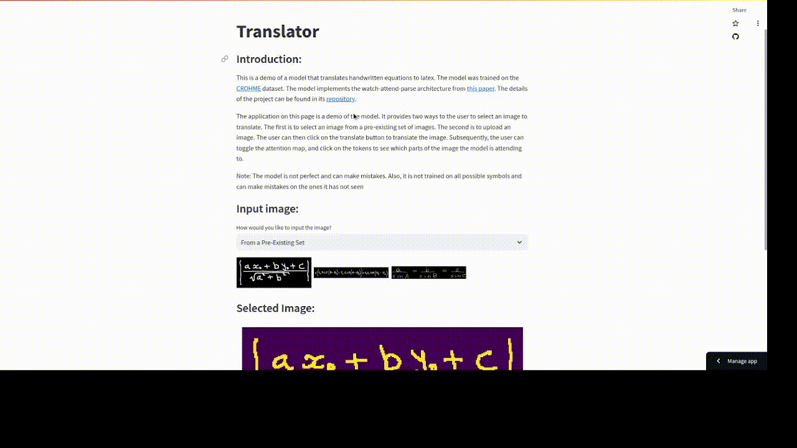
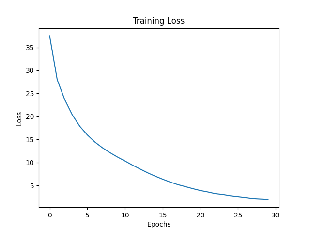
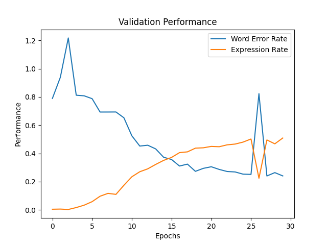

# Image to LaTeX

## Overview
The project is motivated by the need to build an open source application to convert images of handwritten mathematical 
expression to its corresponding LaTeX. The model demonstration can be accessed at this [link](https://image2latex.streamlit.app/).  
<table>
  <tr>
    <td></td>
  </tr>
</table>
## Background and Motivation
LaTeX is one of the most celebrated package of choice for writing rich textual documents especially for writing 
mathematical equations. Typically, most mathematical analysis starts from pen and paper as it has lower cognitive 
load(Longcamp, Zerbato-Poudou, & Valey, 2005). The added work of translating the analysis to digital equations can prove 
to be cumbersome. Thus, there is a need for automating this process for improved productivity. There are many 
commercially available solutions such as MyScript or MathPix. However, such solutions are closed source and paid with a 
limited free tier which can be easily surpassed for a heavy user of the program. This project seeks to fill that gap by 
developing an open source version of this application, which can be freely developed by any person who sees fit. 

## Goals
The goal of this project is to build an end-to-end ML application that converts handwritten documents to LaTeX. The 
application will be fully contained. As such, the user can download and run the application on their local machine. 
The instructions to run the app will be provided. I will also have an app demo running for as long as it is economical. 

## Datasets
I will be using CROHME Dataset. The details of how the dataset is organized and created is provided in 
[dataset review](notes/data_review.md). The data is downloaded and stored locally in the data directory. Executing 
the file 'get_data.sh' copies the data locally. 

## Model

The model trained is inspired from Seq2Seq with attention mechanism. Specifically, I implemented the model called Watch,
attend, parse as described in [2]. Before selecting this model, a detailed literature review was conducted. The details 
of the review is provided in [model review](notes/model_review.md). The model employs a deep convolutional neural
network as the encoder and a recurrent neural network as the decoder. 

The encoder generates a varied number of feature maps proportional to the size of the input image. A soft-attention
mechanism is used to weight these feature maps and generate a context vector. In addition, a history of the past attention
weights is used in the context vector generation. This is done to ensure that the model does not focus on the same region
of the image repeatedly. Now, the decoder uses a gated recurrent unit based RNN to generate the output sequence. The 
choice of GRU is motivated by the fact that it is computationally less expensive than LSTM. The model architecture code
is available in the [model](train/models.py) file. The specific dimensions used are available in the 
[global parameters](train/utils/global_params.py) file. 

## Training

The model is trained using the CROHME dataset. The training is done using the Adam optimizer on cross entropy loss
that minimizes the negative log likelihood of the next token prediction $(p = P(x_i|C, x_0, ..., x_{i-1}))$. The training
parameters are available in the [global parameters](train/utils/global_params.py) file. The training loss and performance
are shown below.

<table>
  <tr>
    <td></td>
    <td></td>
  </tr>
</table>

## Practical Applications and Limitations

The model can be used to convert handwritten mathematical expressions to LaTeX. The model can also be isolated and embedded
into a distributed inference harness to be used as an API service. However, it is important to note that model performance
is limited due to the available compute and the variety of data. For example, the model is trained on a dataset cantaining
about 8000 images and 110 symbols. As we know, there are many more symbols in LaTeX. Thus, the model is limited in its
ability to generalize to unseen symbols. A reasonable improvement can be brought to the model by training on a much larger
dataset, more compute, employing a more sophisticated and capacious model, and using appropriate regularization techniques
to improve generalization. 

## References
[1] Longcamp, M., Zerbato-Poudou, M. T., & Velay, J. L. (2005). The influence of writing practice on letter recognition in preschool children: A comparison between handwriting and typing. Acta psychologica, 119(1), 67-79.  
[2] Zhang, J., Du, J., Zhang, S., Liu, D., Hu, Y., Hu, J., ... & Dai, L. (2017). Watch, attend and parse: An end-to-end neural network based approach to handwritten mathematical expression recognition. Pattern Recognition, 71, 196-206.