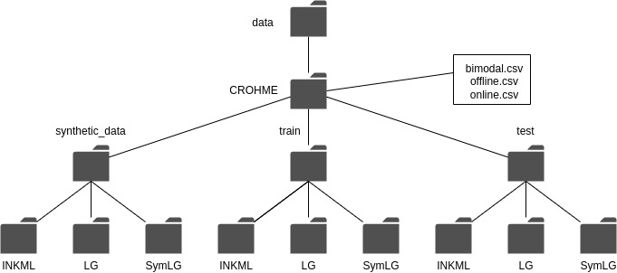

# Image to LaTeX

## Overview
The project is motivated by the need to build an open source application to convert images of handwritten mathematical expression to its corresponding LaTeX. The application can be run as a docker container. 

## Background and Motivation
LaTeX is one of the most celebrated package of choice for writing rich textual documents especially for writing mathematical equations. Typically, most mathematical analysis starts from pen and paper as it has lower cognitive load(Longcamp, Zerbato-Poudou, & Valey, 2005). The added work of translating the analysis to digital equations can prove to be cumbersome. Thus, there is a need for automating this process for improved productivity. There are many commercially available solutions such as MyScript or MathPix. However, such solutions are closed source and paid with a limited free tier which can be easily surpassed for a heavy user of the program. This project seeks to fill that gap by developing an open source version of this application, which can be freely developed by any person who sees fit. 

## Goals
The goal of this project is to build an end-to-end ML application that converts handwritten documents to LaTeX. The application will be fully contained, the user can download the application on their local machine, build the docker image, and spin up the web container. The instructions to run the app will be provided. I will also have an app demo running for as long as it is economical. 

## Datasets
I will be using CROHME Dataset. The details of how the dataset is organized and created is provided in [literature review](notes/paper_reviews.md).
The data is downloaded and stored locally in the data directory as per the following diagram:

## Practical Applications

## Milestones
[x] Complete Literature review of the datasets and the available models  
[ ] Train translator  
[ ] Create the front end of the web app  
[ ] Create the backend of the web app and hook it up to the front-end.  
[ ] Documentation - lessons learned, future improvements etc.  
[ ] Post the app for demonstration

## References
[1] Longcamp, M., Zerbato-Poudou, M. T., & Velay, J. L. (2005). The influence of writing practice on letter recognition in preschool children: A comparison between handwriting and typing. Acta psychologica, 119(1), 67-79.
