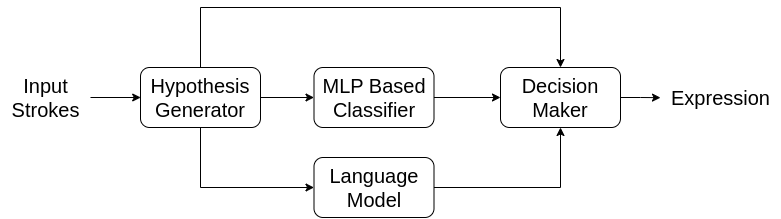
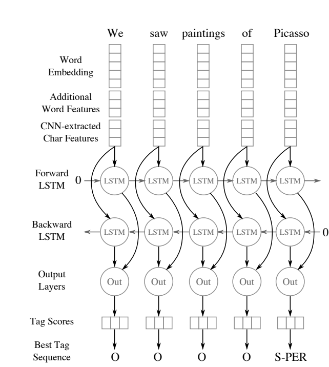

## Models 

### 1. [Towards Handwritten Mathematical Expression Recognition](http://pagesperso.ls2n.fr/~mouchere-h/pdf/Awal_ICDAR2009.pdf)
The architecture is used for online handwritten mathematical expression recognition. An expression recognition follows 
the following pipeline: first, the strokes are clustered into potential symbols. Then, these symbols are classified, and 
the collection of symbols is synthesized into a mathematical expression. The architecture learns the segmentation, 
classification, and synthesis simultaneously. The architecture looks as follows:

The hypothesis generator generates all different combinations of strokes that can be grouped into a symbol. The MLP 
classifier then classifies the symbol. The language model validates the structure of the expression. The decision
module then decides whether to accept or reject the hypothesis. The architecture is trained end-to-end. 

### 2. [Named Entity Recognition with Bidirectional LSTM-CNNs](https://aclanthology.org/Q16-1026.pdf)
Automatic feature recognition with bi-directional LSTM and CNN architecture. BiDirectional LSTM is used to allow context 
information to flow in both directions. CNN is used to capture local information. The architecture looks as follows:

Since it's a name entity recognition problem, we have sentence structure as the input. Thus, there is a need for creating
a character embedding. The words are appropriated parsed and normalized. A separate feature is added to communicate the 
unnormalized property to recover the original character for example allCaps, upperInitial, lowercase,
mixedCaps, noinfo. 

### 3. [Watch, stand, and parse](http://home.ustc.edu.cn/~xysszjs/paper/PR2017.pdf)
Similar setup as before except in this case we encode the image with CNN and then use LSTM with attention mechanism to 
decode the sequence. They started from a model architecture similar to the one used for [image captioning](https://www.cv-foundation.org/openaccess/content_cvpr_2015/papers/Vinyals_Show_and_Tell_2015_CVPR_paper.pdf)

They varied the depth of the CNN to find the best performing model. For the LSTM, they also added coverage vector for 
improved performance. I need to read a little bit more about the coverage.

### 4. [Modeling Coverage for Neural Machine Translation](https://arxiv.org/pdf/1601.04811.pdf)

## Embedding Space

### 1. [Equation Embeddings](https://arxiv.org/pdf/1803.09123.pdf)

Presents an unsupervised approach to embed mathematical equations. They found both the quantitative and qualitative
results in the favor of the embedding as compared to existing word embedding techniques. This paper seeks to encode 
the whole equation as one, which is useless in my case.

### 2. [Translating Math Formula Images to LaTeX Sequences Using Deep Neural Networks with Sequence-level Training ](https://arxiv.org/pdf/1908.11415.pdf)

The authors of this paper parsed the LaTeX formula into latex reserved words. Once they had those, they transformed the 
reserved words into an embedding space. They also added positional encodings to the feature maps extracted from the
source image. Personally, I am not so sure whether positional encodings would help, but it may since localized information
is slowly destroyed in CNNs due the pooling layers. 

