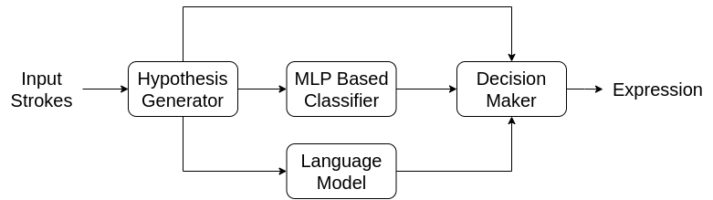
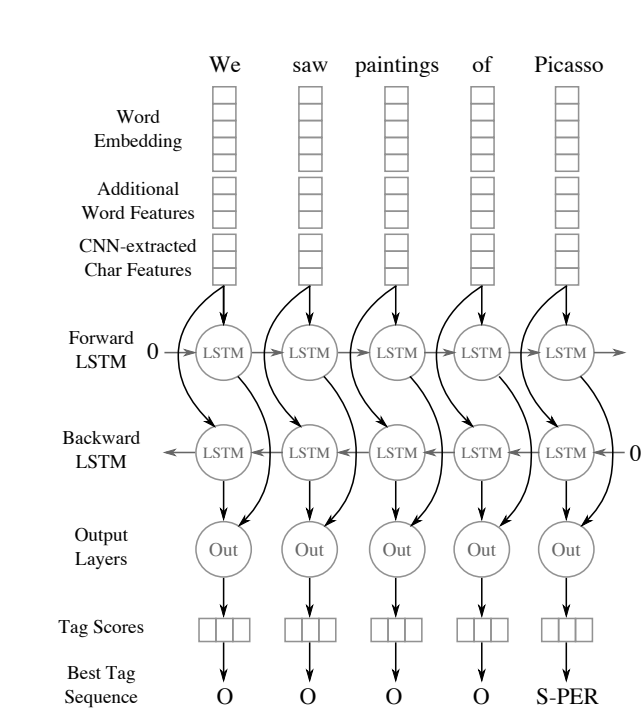

This documents serves to note down my reviews on papers I read for this project. 
# Literature Review
## Docments and Datasets
### 1. [CROHME 2011 Competition on Recognition of Online Handwritten Mathematical Expressions](../data/ICFHR_package/CROHME_papers/CROHME_ICDAR_2011.pdf)
The training set consists of 921 expression and supplies the underlyin ggrammar for understanding the content of the
training data. The test data consists of 348 expressions. The evalutation criteria is based on four different aspects of
the recognition problem. At the time of publication, the best expression level recognition accuracy is 22.41%.

The handwritten mathematical expressions are saved in InkML format. Two parts are defined in the training dataset containing 
296 and 921 expressions respectively. The second part includes the expressions from the 
first part. Part-I expressions are less complex. The expressions are accompanied by their underlying grammar. The test expressions
are different from teh training set. The test set is also divided into two parts just like the training set. The first part contains
181 expressions and the second part contains 348. 

What does an InkML file contain?  
The InkML contains three kinds of information:
1. The trace information: The trace information is the actual ink data. It contains the x and y coordinates of the pen tip.
2. The annotation information: it contains the segmentation and label information of each symbol of the expression.
3. The expression level ground truth as MathML structure. Here is an example of an InkML file for the expression a < b / c:

```InkML
<ink xmlns="http://www.w3.org/2003/InkML">
<traceFormat>
    <channel name="X" type="decimal"/>
    <channel name="Y" type="decimal"/>
</traceFormat>
<annotation type="writer">w123</annotation>
<annotation type="truth">$a<\frac{b}{c}$</annotation>
<annotation type="UI"> 2011_IVC_DEPT_F01_E01 </annotation>
<annotationXML type="truth" encoding = "Content-MathML">
    <math xmlns="http://www.w3.org/1998/Math/MathML">
        <mrow>
            <mi xml:id="A">a</mi>
            <mrow>
                <mo xml:id="B"><</mo>
                <mfrac xml:id="C">
                    <mi xml:id="D">b</mi>
                    <mi xml:id="E">c</mi>
                </mfrac>
            </mrow>
        </mrow>
    </math>
</annotationXML>
<trace id="1">985 3317, ..., 1019 3340</trace>
...
<trace id="6">1123 3308, ..., 1127 3365</trace>
    <traceGroup xml:id="7">
        <annotation type="truth">Ground truth</annotation>
        <traceGroup xml:id="8">
            <annotation type="truth">a</annotation>
            <annotationXML href="A"/>
                <traceView traceDataRef="1"/>
            <traceView traceDataRef="2"/>
        </traceGroup>
        ...
    </traceGroup>
</ink>
```

Five different research groups submitted their system to evaluate their performance. The information about these systems
are only given at a high level. Most of them employ a multi-stage approach where one of the stages is symbol segmentation. 
Some models used Hidden Markov Model while other used feed forward architecture. The systems are evaluated at 4 different level:  
1. Stroke Level Classification Rate - this would enable online handwriting recognition  
2. Symbol Segmentation Rate - whether the symbols are correctly segmented  
3. Symbol Recognition Rate - whether the symbols are correctly recognized
4. Expression Recognition Rate - whether the expression is correctly recognized
For this particular scenario, we are interested in maximizing the 4th metric($EXP_rec$). All systems struggle to get a 
a reasonably high score. SYstem-V is the best performing system with a score of 40.88% on Test Data 1 and 22.41% on Test Data 2.
The system aims to simultaneoulsy optimize symbol segmentation, symbol recognition, and 2D structure recognition with a cost
function that defines the likelihood of a solution. A dynamic programming scheme at the end gives a best solution according
to a 2D grammar and a neural network based classifier. The paper can be accessed [here](https://ieeexplore.ieee.org/document/5277511).

### 2. [CROHME 2012 Competition on Recognition of Online Handwritten Mathematical Expressions](../data/ICFHR_package/CROHME_papers/CROHME_ICFHR_2012.pdf)
Key Differences from 2011:  
1. More samples than before (1336 training and 488 test samples divided into 3 parts). Each part is represented
by its respective grammar. A new part is added to the training set this time. The extent of grammar for various parts
is as follows:
    1.1 Part 1: 296 expressions with 1D grammar containing (a) only 41 terminals with a number of limitation on the logical relationships.
    1.2 Part 2: 921 expressions with 2D grammar - grammar is less restricted than part 1. There are 60 terminal symbols.
    1.3 Part 3: 1336 expressions with 3D grammar - further relaxes the restrictions on part 2. There are 75 terminal symbols including Greek Letters and set operators.
2. More participants including industry research labs (7 Submissions) - best one uses Neural network as a classifier but it
grounded in the realization that segmentation, recognition, and interpretation must be handled concurrently and at the same level.
Another interesting analysis shows the distribution of error is strongly correlated with the length of the expressions.
Longer expressions are more difficult to recognize correctly and thus the accuracy decreases.

### 3. [CROHME 2013 Competition on Recognition of Online Handwritten Mathematical Expressions](../data/ICFHR_package/CROHME_papers/ICDAR_CROHME2013.pdf)
The training set has been expanded to over 8000 expressions! New tools developed for evaluating performance at all levels.
The performance of the participating systems from CROHME 2012 is also reported. In 2013, 8 systems participated as compared
to 6 in 2012.

More participating systems are based on neural networks including LSTM, Vanilla MLPs. The best performing system was 
pretrained on writing samples collected from writers in several countries. Just like before this system also handles
segmentation, recognition, and interpretation concurrently. Further the system was trained using roughly 30,000 math
expressions in a private corpus.

In this case the competition was divided into two parts: first was the most complex expression grammar from 2012 and the second
part had the added grammar. The training data for the first part (1341 expressions) is a subset of the second part.

Now, in terms of the results, the best performing system from 2012 was able to achieve a score of 70.16 on part 1 due to
having a larger training set. The information about whether the system was retrained on the new training set is not given.
For part 2, the organizers also introduced a varying degree of difficulty for the expressions evaluation. For example, they
computed the accuracy under increasing number of allowed errors. The best performing system was able to achieve scores of
60.36, 80.33, 84.95, 86.14 for 0, <= 1, <=2, <=3 errors respectively.

### 4. [CROHME 2014 Competition on Recognition of Online Handwritten Mathematical Expressions](../data/ICFHR_package/CROHME_papers/CROHME_ICFHR_2014.pdf)
In 2014, two additional tasks were introduced - 1. isolated symbol recognition with reject option for invalid symbol hypothesis
and 2. expressions containing matrices. Thus there are three tasks in total:
1. Isolated Symbol Recognition: symbol are first extracted from an expression, and then classified into one of the 101 classes.
The expressions are also mis-segmented on purpose to produce samples with invalid symbols. The system is expected to reject
these invalid symbols. Interestingly, there are no invalid symbols in the training set. The test set contains 9161 invalid
symbols and 10061 valid symbols. 
2. This task concerns itself with recognizing expressions containing matrices. The training dataset contains 362 matrices with 2332
cells and 4281 symbols. The grammar is consistent of expressions is otherwise consistent with task 2. The test dataset contains 175
matrices with 1075 cells and 2101 symbols.

The best performing system from 2013 performs the best again in 2014. The system seems proprietary and does not have 
information about the architecture. The system is trained on a private dataset. The only thing available in the paper is
that it is built on the principle that segmentation, recognition, and interpretation must be handled concurrently and at 
the same level. The system also has a symbol expert that estimates the probability for all parts in the suggested segmentation.
The best system other than the proprietary one is based on a combination of BiLSTM. Its performance however
is significantly worse than the proprietary system. 

### 5. [CROHME 2016 Competition on Recognition of Online Handwritten Mathematical Expressions](../data/ICFHR_package/CROHME_papers/icfhr_crohme2016.pdf)
Just like in previous years, the main task is recognizing formula from handwritten strokes. In addition, following tasks
are also used for evaluation:
2a. Classification of isolated symbols
2b. Classification of isolated symbols with reject option
3. A new task on parsing formula structure from valid handwritten symbols
4. Parsing expressions with matrices.

This time there were 6 participants. MyScript performs the best in all tasks just like before. However the improvement is
only by 5%, which hints at the difficulty of the task. 

### 6. [CROHME 2019 Competition on Recognition of Online Handwritten Mathematical Expressions](../data/ICFHR_package/CROHME_papers/CROHME_2019.pdf)  
In 2019, the participants can choose between two tasks of handwritten formula recognition - 1) Generated from online stroke
data and 2) Generated from offline image data. To compare $\LaTeX$ strings, they are converted stroke based label graphs
defiened over symbols. However, it seems this is only needed for task 1. Overall, the results improved further from last
competition with the best performing system recognizing 77% of the time. There is additional task introduced on typeset
formula detection in document images. Here is the description of various tasks:

Task 1: Online Handwritten Formula Recognition. 1a - recognize isolated symbols. 1b: parse formulas from provided symbols.
Task 2: Offline Handwritten Formula Recognition. 2a - recognize isolated symbols including the invalid ones. 2b: parse 
formulas from provided symbols.
Task 3: Given a document page along with the bounding boxes of characters, identify formulas. 

The best performing system are based on a combination of CNN and RNN. It reaches a classification accuracy of 77.15 for 
task 1b and 2b. It is worth reading about. 

### 7. [2023 CROHME DATASET](https://crohme2023.ltu-ai.dev/data-tools/)  
It seems that the dataset consists of the dataset from the previous cases. We have essentially
three different type of challenges in this:  
1. Online Handwritten Task: in this case the input comes as polylines from a pen. The algorithm is supposed to 
recognize the expression, the bounding box of each symbol and the label of each symbol.
2. Offline Handwritten Task: in this case, the input is a set of prewritten equations.
3. BiModal Handwritten Task: In this case, we have both the poly lines and the prewritten equations as the input.
The dataset is also much bigger than the previous ones. It has over 10979 inkml files with 150k aritifically generated
files. We also have 1045 real equations. The validation set is based on CROHME2016_test set of size 1147. 


### 8. [Image to Latex Dataset - Kaggle](https://www.kaggle.com/datasets/shahrukhkhan/im2latex100k)

## Models 

### 1. [Towards Handwritten Mathematical Expression Recognition](http://pagesperso.ls2n.fr/~mouchere-h/pdf/Awal_ICDAR2009.pdf)
The architecture is used for online handwritten mathematical expression recognition. An expression recognition follows 
the following pipeline: first, the strokes are clustered into potential symbols. Then, these symbols are classified, and 
the collection of symbols is synthesized into a mathematical expression. The architecture learns the segmentation, 
classification, and synthesis simultaneously. The architecture looks as follows:



The hypothesis generator generates all different combinations of strokes that can be grouped into a symbol. The MLP 
classifier then classifies the symbol. The language model validates the structure of the expression. The decision
module then decides whether to accept or reject the hypothesis. The architecture is trained end-to-end. 

### 2. [Named Entity Recognition with Bidirectional LSTM-CNNs](https://aclanthology.org/Q16-1026.pdf)
Automatic feature recognition with bi-directional LSTM and CNN architecture. BiDirectional LSTM is used to allow context 
information to flow in both directions. CNN is used to capture local information. The architecture looks as follows:



Since it's a name entity recognition problem, we have sentence structure as the input. Thus, there is a need for creating
a character embedding. The words are appropriated parsed and normalized. A separate feature is added to communicate the 
unnormalized property to recover the original character for example allCaps, upperInitial, lowercase,
mixedCaps, noinfo. 

### 3. [Watch, stand, and parse](http://home.ustc.edu.cn/~xysszjs/paper/PR2017.pdf)
Similar setup as before except in this case we encode the image with CNN and then use LSTM with attention mechanism to 
decode the sequence. They started from a model architecture similar to the one used for [image captioning](https://www.cv-foundation.org/openaccess/content_cvpr_2015/papers/Vinyals_Show_and_Tell_2015_CVPR_paper.pdf)

They varied the depth of the CNN to find the best performing model. For the LSTM, they also added coverage vector for 
improved performance. I need to read a little bit more about the coverage.

### 4. [Modeling Coverage for Neural Machine Translation](https://arxiv.org/pdf/1601.04811.pdf)


[2011-2014 Dataset](https://www.kaggle.com/datasets/rtatman/handwritten-mathematical-expressions)


